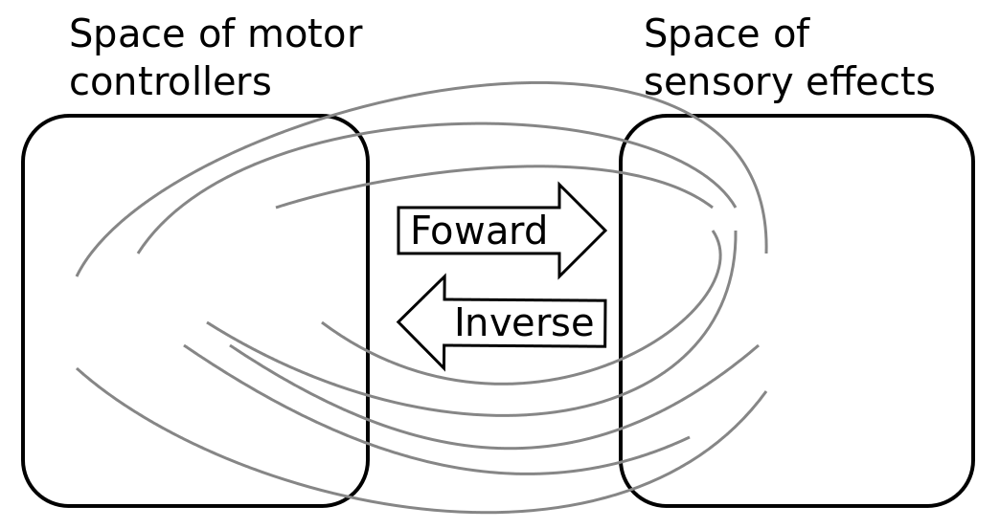

Exploration strategies in Developmental Robotics
================================================

An important challenge in Developmental Robotics is how robots can efficiently learn sensorimotor mappings by experience, i.e. the mappings between the motor actions they make and the sensory effects they produce. This can be a robot learning how arm movements make physical objects move, or how movements of a virtual vocal tract modulates vocalization sounds.

Sensorimotor mappings depend on the physical properties of the interaction between the robot body and the environment in which it evolves, what we call the *sensorimotor system*. Explauto provides a unified interface to define such systems using the :class:`~explauto.environment.environment.Environment` class. The library comes with several built-in sensorimotor systems. Two of them corresponds to simulated environments: a multi-DoF arm acting on a 2D plan (:class:`~explauto.environment.simple_arm.simple_arm.SimpleArmEnvironment` class) and an under-actuated torque-controlled pendulum (:class:`~explauto.environment.pendulum.pendulum.PendulumEnvironment` class). The third one allows to control real robots based on Dynamixel actuators using the `Pypot`_ library (:class:`~explauto.environment.pypot.pypot_robot.PypotEnvironment` class).

Learning sensorimotor mappings involves machine learning algorithms, which are typically regression algorithms to learn forward models, from motor controllers to sensory effects, and optimization algorithms to learn inverse models, from sensory effects, or goals, to the motor programs allowing to reach them. We call these sensorimotor learning algorithms *sensorimotor models*. Explauto provides a unified interface to define such models using the :class:`~explauto.sensorimotor_model.sensorimotor_model.SensorimotorModel` class. The library comes with several built-in sensorimotor models: simple nearest-neighbor look-up, non-parametric models combining classical regressions and optimization algorithms, online mixtures of Gaussians, and discrete Lindstone distributions. Explauto sensorimotor models are online learning algorithms, i.e. they are trained iteratively during the interaction of the robot in the environment in which it evolves.

The way the robot will collects its own sensorimotor experience have a strong impact on learning efficiency because for most robotic systems the involved spaces are high dimensional, the mapping between them is non-linear and redundant, and there is limited time allowed for learning.

    Complex sensorimotor mappings involve a high dimensional sensorimotor spaces. For the sake of visualization, the motor M and sensory S spaces are only 2D each in this toy example. The relationship betwwen M and S is non-linear, divinding the sensorimotor space into regions of unequal stability: small regions of S can be reached very precisely by large regions of M, or large regions in S can be very sensitive to variations in M.: s  as well as a non-linear and redundant relationship. This non-linearity can imply redundancy, where the same sensory effect can be attain using distinct regions in M.

Thus, if robots explore the world in an unorganized manner, e.g. randomly, learning algorithms will be often ineffective because very sparse data points will be collected. Data are precious due to the high dimensionality and the limited time, whereas date are not equally useful due to non-linearity and redundancy.
This is why learning has to be guided using efficient exploration strategies, allowing the robot to actively drive its own interaction with the environment in order to gather maximally informative data to feed the sensorimotor model.

In the recent year, work in developmental learning has explored various families of algorithmic principles which allow the efficient guiding of learning and exploration.

In Explauto, this strategies are called *interest models*. They implements the active exploration process,  where sensorimotor experiments are chosen to improve the forward or inverse prediction of the sensorimotor model. Efficient versions of such mechanisms are based on the active choice of learning experiments that maximize *learning progress*, for e.g. improvement of predictions or of competences to reach goals (`Schmidhuber, 1991`_ ; `Oudeyer, 2007`_). This automatically drives the system to explore and learn first easy skills, and then explore skills of progressively increasing complexity.

Explauto provides a unified interface to define such models using the :class:`~explauto.interest_model.interest_model.InterestModel` class. The library comes with two built-in interest models: *random* sampling as well as sampling maximizing the *learning progress* in forward or inverse predictions.

Both *random* and *learning progress* models can act either on the motor or on the sensory space, resulting in *motor babbling* or *goal babbling* (`Oudeyer and Kaplan, 2007`_; `Rolf and Steil, 2010`_) strategies.

* Motor babbling consists in sampling commands in the motor space according to a given strategy (*random* or *learning progress*), predicting the expected sensory consequence, executing the command through the *environment* and observing the actual sensory effect. Both sensorimotor and interest models are finally updated according to this experience.
* Goal babbling consists in sampling goals in the sensory effect space and to use the current state of the sensorimotor model to infer a motor action supposed to reach the goals (inverse prediction). The robot/agent then executes the command through the *environment* and observes the actual sensory effect. Both sensorimotor and interest models are finally updated according to this experience.

It has been shown that this second strategy allows a progressive covering of the reachable sensory space much more uniformly than in a motor babbling strategy, where the agent samples directly in the motor space.

.. bla bla :math:`a^2+b^2=c^2`

..
.. .. figure:: motor_goal_babbling.png
    :width: 50%
    :align: center
    :alt: alternate text
    :figclass: align-center

.. An agent is able to explore in its motor space M (*motor babbling* as in **A**) or in its sensory effect sapce (*goal babbling* as in **B**).

.. The second principle is that of active learning and intrinsic motivation, where sensorimotor experiments are chosen to gather maximal information gain. Efficient versions of such mechanisms are based on the active choice of learning experiments that maximize learning *progress*, for e.g. improvement of predictions or of competences to reach goals (`Schmidhuber, 1991`_ ; `Oudeyer, 2007`_). This automatically drives the system to explore and learn first easy skills, and then explore skills of progressively increasing complexity.

`Our research team <https://flowers.inria.fr/>`_ has combined both principles into a more general family of autonomous exploration architecture (`Baranes, 2013`_) and recently expressed as a compact and unified formalism (`Moulin-Frier, 2013`_).

The resulting architecture is summarized below.

.. figure:: architecture.png
    :width: 25%
    :align: center
    :alt: alternate text
    :figclass: align-center

    The Explauto architecture involves three processing levels. M and S are the motor and the sensory space. X is called the *interest space*: it corresponds to M in motor babbling stategies and to S in goal babbling ones. Light arrows are training signals.

Explauto builds upon these research and provides a software library to simulate autonomous exploration in virtual an robotic agents.

.. _Rolf and Steil, 2010: http://cor-lab.org/system/files/RolfSteilGienger-TAMD2010-GoalBabbling.pdf
.. _Oudeyer and Kaplan, 2007: http://www.pyoudeyer.com/oudeyer-kaplan-neurorobotics.pdf
.. _Schmidhuber, 1991: http://web.media.mit.edu/~alockerd/reading/Schmidhuber-curiositysab-1.pdf
.. _Oudeyer, 2007: http://www.pyoudeyer.com/ims.pdf
.. _Baranes, 2013: http://www.pyoudeyer.com/ActiveGoalExploration-RAS-2013.pdf
.. _Moulin-Frier, 2013: http://hal.inria.fr/hal-00860641

.. _Pypot: http://www.poppy-project.org/pypot-library
